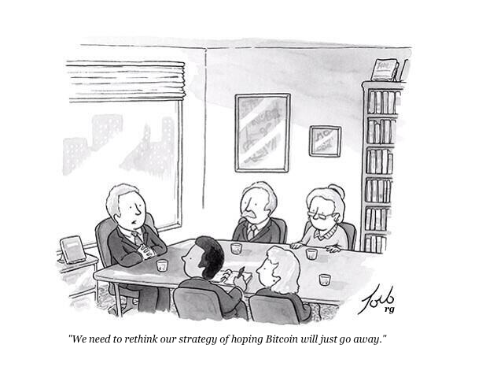

### Genesis

This project is inspired by: https://github.com/genesisdotre/Bitcoin-Games-nLightning-Mind-Chrome-Extension

I was trying to find if there is a way of streaming payment, literally satoshis per second.

Question on StackOverflow: https://bitcoin.stackexchange.com/questions/88117/does-lightning-network-has-concept-of-continuous-stream-of-value

> Streaming payments is not part of the lightning network protocol yet.
> However you can build a lightning app that simulates exactly this.

> **I'm stealing this idea. Not exactly stealing because I feel partially responsible for thinking about it, just not being fully aware if this is already a part of the protocol**

<!-- 
RANDOM UNRELATED

https://twitter.com/skddc/status/946008107800584192
Been to 34c3, had a brief chance to say "hi" to @starkness and @peterktodd and  appreciate their work (they are public figures, they don't remember)
-->

# Building blocks are here, conecting the . . .

* https://cantbeevil.com/
* https://devpost.com/software/lightning-subscription-can-t-be-evil-streaming-payment

### Lightning Subscription Dashboard 

Lightning Stream Design

https://github.com/lightningnetwork/lnd/pull/2455

### Can't be evil

> build and support technology that can’t abuse users

You are in control of all your subscriptions.

Pay for the stuff you are actually using

**REVOLUTIONARY, PARADIGM SHAPESHIFTING**

It’s not Netlix and other companies keeping your billing details, credit card data.

It’s not service providers keeping your upfront payments

It’s not banks overcharging you 

It’s you making payments to them.

You are in full control, they cannot run away with your money, they can’t be evil.

Be in full control of your `sat`, `sat` are within your control at all times when using all the subscription-based business:
* Insurance.
* Rent.
* Mobile phone.
* Gym.
* Netflix.

#### Example a mobile plan.

Currently:  12 month contract, 1 month rolling contract, PAYG pre-paid credit with $10 coupon code

Now we have a new option: satoshis per second

Contract day: 1 month
Default increment: 1 hour
Default prepayment: 1 day

#### Example insurance.

Currently: paying monthly premiums.

Now you can pay every day, having more liquidity.

Contract day: 1 year
Default resolution: 1 day
Default prepayment length: 1 day

#### Example bike rental.

As obvious as it gets. No preauthorisation, no nothing, just PAYG (pay as you go)

Contract length: 1 day
Default increment: 1 minute
Default prepayment: 1 hour

### Partnerhips integrations 
### Real-life use case
### Receiving end 
Let's assume the project is not completed and now you have an ability to stream payments on Lightning Network. But who will be the receiver on the other end?

Bitrefill - `13 June 2019` - https://www.coindesk.com/bitcoin-startup-bitrefill-raises-2-million-seed-round-for-worldwide-expansion

OpneNodee - `19 Decemeber 2018` - https://bitcoinmagazine.com/articles/bitcoin-payment-processor-opennode-gets-125m-investors

To make a great looking demo, we will probably have to create some fictional businesses that can accept streming payments:

* Echelon mobile
* Webflix (Netflix)
* Perpetual Insurance
* Digital Sea (Digital Ocean)

PayPal equivalent

https://developer.paypal.com/docs/integration/direct/webhooks/event-names/#billing-plans-and-agreements

`BILLING_AGREEMENTS.AGREEMENT.CANCELLED`

### Sensinble defaults

### Buffer reservoire grace period

I don’t want to lose my subscription just because my node went offline.

I pay for my internet, my internet is down, cannot SSH to my node and fix it. Catch-22, just like this outage by Google:  https://www.wired.com/story/google-cloud-outage-catch-22/

There should be some tolerance / reservouire / buffer.

As my longevity as a customer increases, as valued customer, the service provider can tweak their values.

Initially, as we operate in a trustless (hostile) environment, it will be a customer who can prepay for the service, if they wish to.

I think it should be voluntary. If my node stay online 24/7/365 then I do not have to prepay, otherwise its my voluntary decision to prepay for a day (have a buffer) and then do micropayments every 1000 sat.

### Satoshis per second

Fees on lightning network: unfairly cheap.

BUT… I ran into a feature, when I couldn’t not send `1 sat` because there were some limits . If the fee is `1 sat`, then cannot send `1 sat`.

We don’t want to send `1 sat` and spend `1 sat` to send it.

I suggest we set the default for 1000 sat which is $0.08 at the current prices.

For some shortlived interactions, satoshis per second would be cool

I’m worried about overheads and tackling edge cases.

All this effort to split $10 into individual satoshis?

At some level it sounds like an engineering porn.

At the same time it’s genuinely cool, 

### ARCHITECTURE
I’m in love with Node Launcher.
https://medium.com/lightning-power-users/windows-macos-lightning-network-284bd5034340

It’s unfairly easy to run your full node (pruned version in case you don’t have enough storage).

Currently there is no “force push” to a force it.

Currently the invoice has to be generated first and only then sent.

I saw somewhere in the Slack discussions that there is a PR for that, likely to change in the future.

If my node is online and their node is online then I can request the new invoice via REST API, get the invoice and pay it.

If my node is offline, then cannot pay anyway.

If their node is offline, then cannot pay anyway.

That’s why for simplicity we can assume for nodes are online.

### Full control, can't be evil?

Ignorance is a bliss. So let's assume I rented a VPS and it's spinning CPU cycles... Is it really my own node, how do I assure it's not backdored right from the getgo?

https://security.stackexchange.com/questions/211243/what-are-the-techniques-to-know-if-vps-cloud-hosting-provider-is-accessing-my-da

https://canarytokens.org/generate

When the 

### Related projects ecosystem

Since I started working on this project, something interesting happened, check this out:

Joule Allowances - `13 June 2019`: https://twitter.com/wbobeirne/status/1139229792128180224

> This is ideal for apps that have small, frequent payments to access content (For instance, a video streaming platform that charges you for every minute of viewing time.)

Sablier - `1 June 2019`: https://twitter.com/PaulRBerg/status/1134773451888238592

> It's a decentralised app for continuous payments. Up to you to decide what to use it for, but works best for paying salaries by the minute 💸

https://github.com/ethereum/EIPs/issues/1620

### Join the team

* Dave JarvisTrade       
* marsXrobertson@gmail.com
* [@marsXrobertson](https://twitter.com/marsXrobertson) on Twitter

Talk is cheap, show me the code. But maybe if I create a good looking readme and desctibe the problem accurately, you'll be ina 